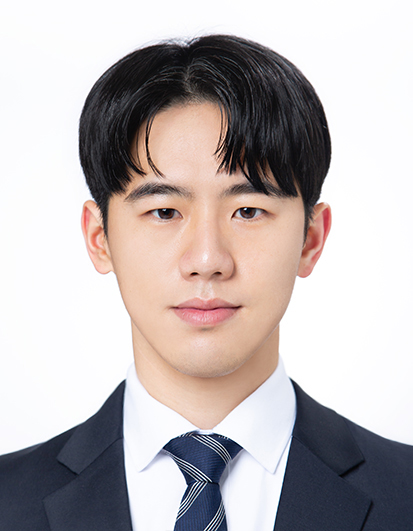

<!-- 

 -->
<!--  -->

<!--  -->

I am GunGyeom "James" Kim (김건겸). I finished my Master of Computer Science (mscs) at [NorthEastern University](https://www.northeastern.edu/) recently.
Before this, I studied Mathematics Education in my undergraduate at [SangMyung University](https://www.smu.ac.kr/). 
[\[CV\]](../cv.pdf)

Outside of my profession, I love playing soccer, reading manga and webtoon, and any indoor/outdoor activity. I value helping community and volunteering, so I try to participate regularly.

## profession
### mscs
#### class
* Advanced Perception, Pf. Bruce Maxwell, Fall 2023
* Web Development, Pf. Tony Mullen, Summer 2023
* \[Audit\] Machine Learning with Small Data, Pf. Michael Wan, Summer 2023
* Pattern Recognition & Comput Vision, Pf. Bruce Maxwell, Spring 2023
* \[Audit\] Foundations of Artificial Intelligence, Pf. Jonathan Mwaura, Spring 2023
* Database Management System, Pf. Scott Valcourt, Fall 2022
* Cutting-edge data visualization with web technologies, Pf. Philip Bogden, Fall 2022
* Algoritms, Pf. Alan Jamieson, Summer 2022
* Intro to Data Management, Pf. Philip Bogden, Summer 2022

.
* \[Audit\] Intro to Linear Algebra and Probability, Pf. Jonathan Mwaura, Summer 2022
* Object-Oriented Design, Pf. Gary Cantrell, Spring 2022
* Data Structure, Algorithm & Application in Computer Science, Pf. Scott Valcourt, Spring 2022
* Intensive Foundations of CS, Pf. Lindsay Jamieson, Fall 2021
* Discrete Structures, Pf. Alan Jamieson, Fall 2021

#### teaching assistant
* Algoritms, Pf. Jonathan Mwaura, Spring 2023
* Algoritms, Pf. Alan Jamieson, Fall 2022
* Data Structure, Algorithm & Application in Computer Science, Pf. Scott Valcourt, Summer 2022
* Discrete Structures, Pf. Alan Jamieson, Spring 2022
* Math Preparion course for incoming align student, Pf. Richard Hosino, Winter 2021, Summer 2022, Winter 2022, Summer 2023

### project
TBU

### experience
* Teaching Assistant and Compute Science Tutor, Jan 2022 - April 2023
* Trainee Teacher - Math, Attached Girl's Highschool to College of Education, SangMyung University, Apr 2021
* Math Teacher, Hansol Academy, Mar 2018 - Feb 2019

## personal
### volunteer
* Math Motivator at Portland High School, Jan 2022 -
* 22nd Happymove Global Youth Volunteers, Feb 2019
* 2019 Rainbow Festival - Volunteer Staff, Jul 2019
* Bucheon Immigrant Support Center - Volunteer Staff, Jul 2019
* Seodaemoon Child Center - Teaching Assitance, Mar 2017 - Oct 2017

### soccer
* Thunder United FC, Summer 2023
    - Runner-up in Soutern Maine United Soccer League Suumer 2023
* Muke, 2020 -
    - Created in 2020 as Cheonan High School 57th alumni futsal team
* SangMyung Footbal Association, 2018 - 2019
    - Head of the association in 2018
    - Advisor of the association in 2019
* Saboom, 2018 -
    - Created in 2020 as College of Education, SangMyung University football team
    - Head of the team in 2018
* Medusa, 2013 - 
    - Head of the team in 2017 and 2018
